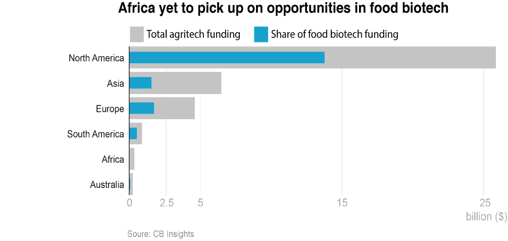
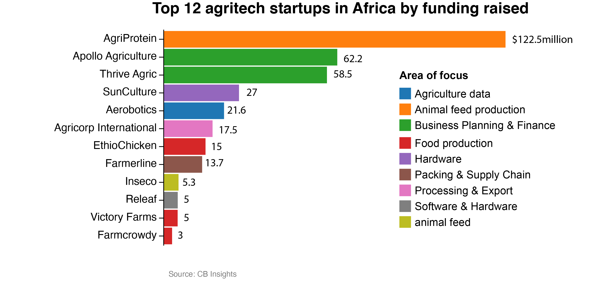
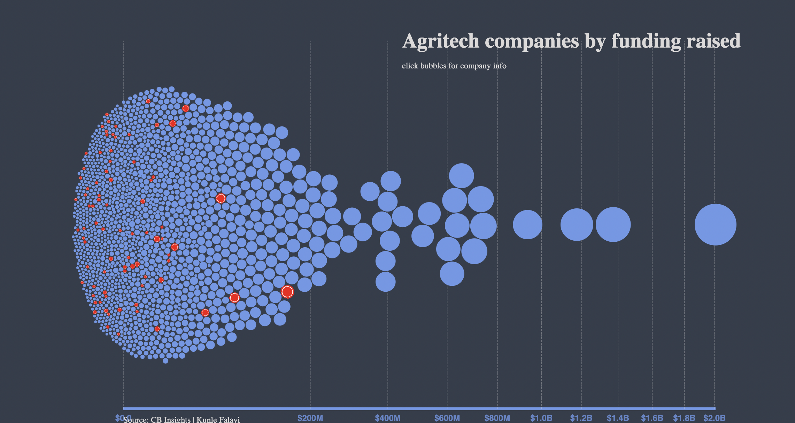

# Feeding-a-nation — Data journalism thesis

## How I found this idea
I wanted to write an original story, preferably one that contributes to the understanding of a simple subject with high importance in Africa. 

As a journalist who has worked most of my career in the continent, I have always been concerned about one problem that comes with high population — food insecurity, a problem that comes with high population. I initially wanted to report on what new entrepreneurs working to provide food security solutions in the continent are doing to attract so much investors that all stories about agriculture and food sector are talking about. Media reports talk about many agriculture startups popping up in different parts of the continent, especially sub-Saharan Africa and attracting investors. So, I thought I could tell a story of this by basically looking at available data on how much money are being invested and how this money are helping to solve the problem.

## Understanding what is not being reported
My first step is to read as much as possible about agriculture tech startups, food startups and venture capital funding in the continent. I found reports such as the Africa Investment Report published annually by Briter Bridges, a research and market intelligence organization, to be a great way to start. I read all the reports released from 2016 to 2021. Then, I made a catalogue of all published stories  about African agriculture startups since 2016. The idea was to see the central message of these stories and what I felt they are missing. One of the things that I noticed early on was that all of them point to how funding for agriculture startups has increased a lot in the last few years and how investors seemed to see Africa as the favorite place to invest in agriculture startups. Each time I read a story and I saw a reference to a data source, I went after that data source. My intension was to see the pattern of investment. I wanted to see who is investing in these startups,  where most Africa’s agriculture startup investors are concentrated and why.

## Finding data
To tell that kind of story, looking at all available data is important. So, from the data sources I had collated from different stories I had read, I collected datasets which I later realized were incomplete to give me a good picture of what I was trying to understand. Luckily, one of the stories cited a data from CB Insights, another research and market intelligence organization. A check on the Columbia Libraries database showed that with my Columbia login, gave me access to CB Insights database. I checked for a few agriculture startups and saw they have profiles on the database and more than that, CB Insights has a database of all agriculture startups in the world along with all information on each relating to founders, board members and fundings they have ever raised. The only startups missing details about funding raised in the database are startups who do not make their funding public.

It was my eureka moment. But I was cautious. For days, I checked how reliable the large agriculture startup database is, by basically searching for every agriculture startup I have read about or heard. If anyone doesn’t not pop up in the database, then I can decide to what extent I can start to trust the database. But I did more than this.  Whenever I read somewhere that an agriculture startup had just raised funding, I went to the database immediately and to see if that funding had reflected. It was what made me realize that the database is quite up to date and very reliable in terms of updating new funding raised by startups. The only detail missing in this database that would have aided my previous story idea was the country of origin of the investors of each startup. The dataset was too large for me to manually search for these.

Apart from [CB Insights](https://app-cbinsights-com.ezproxy.cul.columbia.edu/cxn/2823/4269), [Pitch Book](https://pitchbook.com/) in the Columbia Business School library, has similar details which any Columbia student also have access to.

## Analysis and hypothesis
After I downloaded the database and cleaned up the dataset by standardizing country names, I did some basic analysis on the dataset. I tried to the distribution of agriculture startups by country and funding to see how much funding are raised by startups from different parts of the world. Then I analyzed their solution focus to see what is getting most money. An image immediately appeared. Despite all the stories about African agriculture startups raising so much money, a very tiny portion of startup fundings globally are going to Africa. 

I decided to form my idea around this. But this idea was still too general. CB Insights provide broad categorization of solution focus of each startup. I decided to manually recategorize the solution focus of each African agriculture startup for easy understanding. This required finding what each company does on Google. I then came up with the following categories: biotech, agriculture data, animal feed production, business planning and finance, food production, packing and supply chain, processing and export, software and hardware.

Even though all these are important areas of agriculture in Africa, I realized from my analysis that startups which are in core food production business are attracting only little funding. 
My next step was to find out what the entrepreneurs and investors on the ground feel about areas they felt investors were avoiding. They confirmed the same thing shown by the data. My preliminary interviews with many sources showed that indeed investors are avoiding many of those startups because they are just too risky. I knew that has to be my story because I found no single story that has been done which highlights the peculiar problem of core food producing startups been avoided by most investors.  

## Choosing the right visualization
I spent a long time deciding how best to show the size of funding and also be able to incorporate elements such as countries and continents of each agritech company. I wanted to use a map. But I couldn't convince myself how a choropleth map or a bubble map would do justice to what I needed to show. I spent a long time scouring Observable to find inspiration and I finally chanced on Dea Bankova's [chart](https://observablehq.com/@deaxmachina/fortune-1000-us-companies-2020). Props to you Dea for such amazing portfolio. So, apart from this, I used D3 for the animated line chart while datawrapper for the other two simple bar charts. 

